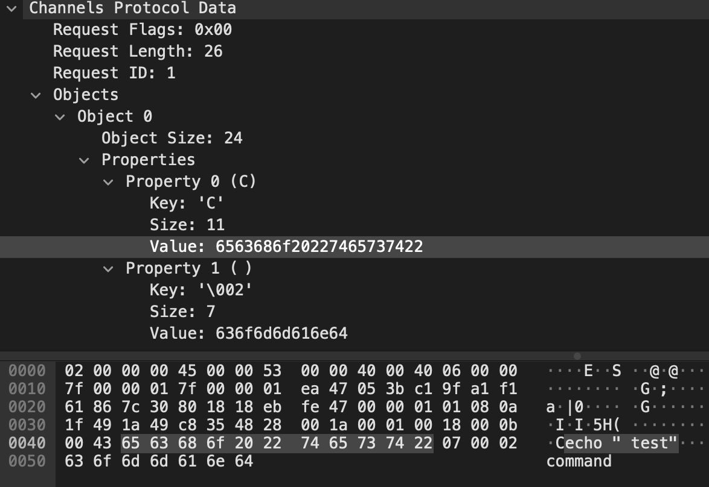

# Inspecting traffic in Wireshark



If you want to inspect traffic for irregularities, or debugging, open Wireshark, select Help->About, select Folders,
select Personal Plugins, and create a following file `channels.lua` there:

```lua
channels_protocol = Proto("CHANNELS_PROTO", "Channels Protocol")

f_request_flags  = ProtoField.uint8("channels.request_flags", "Request Flags", base.HEX)
f_request_length = ProtoField.uint16("channels.request_length", "Request Length", base.DEC)
f_request_id     = ProtoField.uint16("channels.request_id", "Request ID", base.DEC)
f_request_objects = ProtoField.none("channels.request_objects", "Objects")
f_object = ProtoField.none("channels.object", "Object")
f_object_size = ProtoField.uint16("channels.object_size", "Object Size", base.DEC)
f_object_properties = ProtoField.none("channels.object.properties", "Properties")
f_object_property = ProtoField.none("channels.object.property", "Property")
f_object_property_key = ProtoField.char("channels.object.property.key", "Key")
f_object_property_size = ProtoField.uint16("channels.object.property.size", "Size")
f_object_property_value = ProtoField.bytes("channels.object.property.value", "Value")

channels_protocol.fields = { 
	f_request_flags,
	f_request_length,
	f_request_id,
	f_request_objects,
	f_object,
	f_object_size,
	f_object_properties,
	f_object_property,
	f_object_property_key,
	f_object_property_size,
	f_object_property_value,
}

local function dissect_req_pdu(tvbuf, pktinfo, root)
	local subtree = root:add(channels_protocol, tvbuf(), "Channels Protocol Data")

	local request_flags = subtree:add_le(f_request_flags, tvbuf(0, 1))
	local request_length = tvbuf(1, 2):le_uint()
	subtree:add_le(f_request_length, tvbuf(1, 2))
	local request_id = subtree:add_le(f_request_id, tvbuf(3, 2))
	local request_objects = subtree:add_le(f_request_objects, tvbuf(5, request_length))

	local consumed_offset = 0
	local current_object_id = 0
	while (consumed_offset < request_length)
	do
		local object_size = tvbuf(consumed_offset + 5, 2):le_uint()
		print("object size " .. object_size)
		local o = request_objects:add_le(f_object, tvbuf(consumed_offset + 5, object_size + 2))
		o.text = "Object " .. current_object_id
		o:add_le(f_object_size, tvbuf(consumed_offset + 5, 2))
		local props = o:add_le(f_object_properties, tvbuf(consumed_offset + 7, object_size))

		local consumed_properties = 0
		local current_property_id = 0
		while (consumed_properties < object_size)
		do
			local property_size = tvbuf(consumed_offset + consumed_properties + 7, 2):le_uint()
			local property_key = tvbuf(consumed_offset + consumed_properties + 9, 1):le_uint()
			local prop = props:add_le(f_object_property, tvbuf(consumed_offset + consumed_properties + 7, property_size + 3))
			prop.text = "Property " .. current_property_id .. " (" .. string.char(property_key) .. ")"
			prop:add_le(f_object_property_key, tvbuf(consumed_offset + consumed_properties + 9, 1))
			prop:add_le(f_object_property_size, tvbuf(consumed_offset + consumed_properties + 7, 2))
			prop:add_le(f_object_property_value, tvbuf(consumed_offset + consumed_properties + 10, property_size))
			consumed_properties = consumed_properties + property_size + 3
			current_property_id = current_property_id + 1
		end
		consumed_offset = consumed_offset + consumed_properties + 2
		current_object_id = current_object_id + 1
	end
end

local function get_req_length(tvbuf, pktinfo, offset)
	local request_size = tvbuf:range(offset + 1, 2):le_uint()
	print("get_req_length " .. request_size)
	return request_size + 5
end

function channels_protocol.dissector(tvb, pinfo, tree)
	dissect_tcp_pdus(tvb, tree, 5, get_req_length, dissect_req_pdu)
end

local tcp_port = DissectorTable.get("tcp.port")
tcp_port:add(1339, channels_protocol)
```