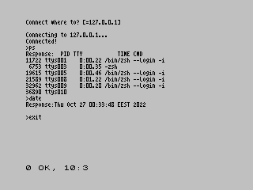

# Terminal example

This example implements a server that listens on port 1339 using Proto protocol, and executes every
linux shell command it receives.

The client is a "terminal" program, that connects to the server, read the input, sends the command and
prints out a response.

You don't have to build the client, you can download it on
[example_terminal_client.tap](https://github.com/speccytools/zx-proto/raw/master/examples/terminal/client/example_terminal_client.tap)

You need an emulator that supports Spectranet, or a real device.

The server, however, can be trivially built using build.sh on the terminal/server directory.

